# Product Requirements Document: Road to Menkyo (免許の道)

**Version:** 1.0  
**Date:** 2026-02-10  
**Status:** Draft - Awaiting Review

---

## 1. Executive Summary

**Road to Menkyo** (免許の道 - "Path to the License") is a roguelike deckbuilder study game designed to help players prepare for the Japanese driver's license exam (運転免許試験). Built on the **Slay-The-Robot** Godot 4 framework, it transforms the repetitive and stressful exam preparation into an engaging, addictive gameplay experience.

### Core Value Proposition
> **"Turn exam anxiety into game addiction."**

The Japanese driver's license exam is notorious for:
- Trick questions (ひっかけ問題)
- Volume of memorization required
- High failure rates

By gamifying this experience through a proven deckbuilder format, we leverage:
- **Spaced repetition** through roguelike structure
- **Active recall** through quiz-based combat
- **Contextual learning** through card deck archetypes

---

## 2. Product Vision

### 2.1 Target Audience

| Segment       | Description                                                                 |
|---------------|-----------------------------------------------------------------------------|
| **Primary**   | **Foreigners living in Japan** who need to take the menkyo test in Japanese |
| **Secondary** | Japanese residents preparing for the Menkyo Shiken (ages 18-30)             |
| **Secondary** | Japanese language learners studying traffic vocabulary                      |
| **Tertiary**  | Fans of roguelike deckbuilders looking for unique themes                    |

### 2.2 Bilingual Support System (JP ↔ EN)

The game provides **heavy Japanese ↔ English glossary support** and contextual translations throughout.

#### Tap-to-Learn Feature
Tap any Japanese term to see:
- **Reading** (ふりがな / romaji)
- **English translation**
- **Contextual explanation**
- **Related terms**

#### Language Modes

| Mode          | Description                                      |
|---------------|--------------------------------------------------|
| **JP + EN**   | Both languages shown (default for learning)      |
| **JP Only**   | Exam simulation mode (authentic test experience) |
| **EN Assist** | English hints available on demand                |

### 2.3 Dual-Mode Architecture
The game supports two distinct modes controlled by a global switch:


| Mode      | HP       | Timer    | Enemy Attacks | Use Case                          |
|-----------|----------|----------|---------------|-----------------------------------|
| **GAME**  | Limited  | Active   | Yes           | Challenge runs, testing knowledge |
| **STUDY** | Infinite | Disabled | No            | Learning, memorization, review    |

---

## 3. Game Design

### 3.1 Core Metaphor

| Game Concept | Menkyo Translation                                       |
|--------------|----------------------------------------------------------|
| Player HP    | 精神力 (Mental Stamina / Focus)                          |
| Enemy        | Traffic Situation / Exam Question                        |
| Deck         | Knowledge Base (Concepts & Logics)                       |
| Attack Cards | Answer Logic (stopping rules, sign identification)       |
| Skill Cards  | Study Utilities (process of elimination, time extension) |
| Power Cards  | Passive Buffs (prediction abilities, combo bonuses)      |
| Energy       | Focus Points (mental resources per turn)                 |
| Damage       | Knowledge Damage (progress toward solving a question)    |

### 3.2 Battle System (The Quiz Mechanic)

This is the **core innovation** - every card play is intercepted by a quiz prompt.


### 3.3 Turn Structure

1. **Enemy Intent Phase:** Display driving scenario + question + threatened damage
2. **Draw Phase:** Player draws 5 cards from deck
3. **Player Phase:** Play cards (each triggers quiz intercept)
4. **Enemy Phase:** If unanswered or player ends turn, enemy deals "Confusion Damage"
5. **End Turn:** Resolve status effects, prepare next turn

### 3.4 Card Types & Archetypes

#### Card Categories

| Type       | Color | Icon                       | Function                                         |
|------------|-------|----------------------------|--------------------------------------------------|
| **Attack** | Red   | ガベル (Gavel) / Checkmark | Deal Knowledge Damage when answered correctly    |
| **Skill**  | Blue  | Brain / Deep Breath        | Utility: draw cards, gain block, manipulate deck |
| **Power**  | Gold  | Connecting Gears           | Persistent buffs for the combat                  |

#### Deck Archetypes

| Archetype             | Focus                             | Playstyle                            |
|-----------------------|-----------------------------------|--------------------------------------|
| **Defensive/Safety**  | 徐行 (Slow Down), 一時停止 (Stop) | High block, patient, 100% accuracy   |
| **Rules Lawyer**      | Numbers (30m, 5t, speed limits)   | High risk/reward, one-shot potential |
| **Hazard Prediction** | 危険予測 (Kiken Yosoku) visuals   | Generate "Insight" for auto-solve    |

### 3.5 Status Effects

| Effect        | Icon | Description                             |
|---------------|------|-----------------------------------------|
| **Confused**  | 😵   | Answer buttons are shuffled/blurred     |
| **Rushed**    | ⏱️    | Half time to answer                     |
| **Confident** | 💪   | Next correct answer fully heals HP      |
| **Cursed**    | 🃏   | Trick Question cards shuffled into deck |

---

## 4. Map & Progression

### 4.1 Map Nodes

The map represents the **curriculum roadmap** - a branching scroll with road-themed visuals.

| Node Type         | Icon              | Description                            |
|-------------------|-------------------|----------------------------------------|
| **Normal Combat** | 🚦 Traffic Light  | 5-question quiz on general rules       |
| **Elite Combat**  | 👮 Police Officer | 10-question hard quiz (specific topic) |
| **Rest Site**     | 🅿️ Parking Sign   | Heal HP or Upgrade a card              |
| **Merchant**      | ⛽ Gas Station     | Buy cards/relics with Focus Points     |
| **Event**         | ❓ Question Mark   | Random moral dilemma or bonus          |
| **Boss**          | 🏛️ Exam Center    | 50-question endurance run              |

### 4.2 Progression Structure

```mermaid
graph TD
    A[Act 1: Basic Traffic Rules] --> B[Boss: 仮免学科 Provisional Written]
    B --> C[Act 2: Road Signs & Signals]
    C --> D[Boss: 仮免技能 Provisional Practical]
    D --> E[Act 3: Highway & Complex Rules]
    E --> F[Final Boss: 本免試験 Full License Exam]
```



### 4.3 Rewards

#### Post-Combat Rewards
- Choose 1 of 3 new card concepts to add to deck
- Earn Focus Points (currency)
- Occasionally earn Relics

#### Relic Examples

| Relic                     | Effect                                     |
|---------------------------|--------------------------------------------|
| **Baby on Board Sticker** | Start combat with +1 Energy                |
| **Glasses**               | Keywords highlighted in questions          |
| **Lucky Omamori**         | First wrong answer each combat is forgiven |
| **Green Light Charm**     | First correct answer deals double damage   |

---

## 5. Content Data Structure

> [!NOTE]
> **Data Cleanup Complete (2026-02-10)**
> - Question data: `_data_normalized/` (4 normalized JSON files)
> - Image assets: `_assets/images/` (529 deduplicated images)
> - Path mapping: `_assets/image_path_mapping.json`
> - JP↔EN glossary: Separate project (needs merge)

### 5.1 Data Sources Overview

| Source             | Cards     | Type                                   | Structure                   | Images      |
|--------------------|-----------|----------------------------------------|-----------------------------|-------------|
| **navitime.json**  | 2,172     | True/False (90.5%), Image Match (9.5%) | Exam-based (69 categories)  | 619 (28.5%) |
| **scrape.json**    | 1,303     | True/False (100%)                      | Topic-based (98 categories) | 413 (31.7%) |
| **trips.json**     | 624       | Quiz (~80%), Flashcard (~20%)          | 仮免許 (Provisional)        | Mixed       |
| **tripsfull.json** | 1,364     | Quiz (~90%), Flashcard (~10%)          | 本免許 (Full License)       | Mixed       |
| **TOTAL**          | **5,463** |                                        |                             | ~1,000+     |

### 5.2 Existing Flashcard Schema

All JSON files already conform to the Universal Flashcard Schema:

```json
{
  "id": "q_10101",
  "question_text": "交通規則は、みんなが道路を安全、円滑に通行するために守るべき共通の約束ごととして決められている。",
  "question_type": "true_false",
  "options": [
    {"index": 0, "text": "○", "is_correct": true},
    {"index": 1, "text": "×", "is_correct": false}
  ],
  "correct_answer": 0,
  "answer_format": "index",
  "category_path": ["Navitime", "運転者の心得"],
  "category_ids": ["cat_navitime", "cat_navitime_運転者の心得"],
  "question_image_url": null,
  "explanation_text": "交通規則は...守るべき共通の約束ごととして決められています。",
  "difficulty": null,
  "tags": ["Navitime"]
}
```

### 5.3 Question Types for Game Integration

| Type                       | Game Usage                     | Card Mapping           |
|----------------------------|--------------------------------|------------------------|
| **true_false** (○/×)       | Standard quiz intercept        | All Attack/Skill cards |
| **image_match**            | Hazard Prediction (危険予測)   | Kiken Yosoku cards     |
| **flashcard** (暗記カード) | Sign recognition, memorization | Power/Buff cards       |

### 5.4 Category Mapping to Game Archetypes

| Category (JP)       | English               | Game Archetype             |
|---------------------|-----------------------|----------------------------|
| 標識 / 標示         | Signs / Road Markings | Sign Identification deck   |
| 駐車 / 停車         | Parking / Stopping    | Parking Rules deck         |
| 交差点              | Intersections         | Priority/Right-of-Way deck |
| 徐行 / 一時停止     | Slow Down / Stop      | Defensive deck             |
| 高速道路            | Highway               | Highway Rules deck         |
| 仮免演習 / 本免演習 | Exam Practice         | Boss Battles               |
| 暗記カード          | Memorization Cards    | Flashcard/Power cards      |

### 5.5 Card ↔ Question Linking Strategy

Cards link to questions via **category tags** (not individual IDs):

```gdscript
# When playing a card, fetch random question from matching category
func get_question_for_card(card: CardData) -> Dictionary:
    var matching_cards = []
    for data_source in ["navitime", "scrape", "trips", "tripsfull"]:
        var deck = load_deck(data_source)
        for q in deck.cards:
            if card.question_category in q.category_path:
                matching_cards.append(q)
    return matching_cards[randi() % matching_cards.size()]
```

### 5.6 Image Asset Consolidation

| Source     | Unique Images | Duplicates Removed |
|------------|---------------|--------------------|
| navitime   | 194           | 39                 |
| trips      | 202           | 23                 |
| trips_full | 133           | 147                |
| **Total**  | **529**       | **209**            |

Images are prefixed by source: `navitime_*.png`, `trips_*.png`, `trips_full_*.png`

### 5.7 Content Assets Status

| Asset Type              | Status           | Location                          |
|-------------------------|------------------|-----------------------------------|
| ✅ Question JSON         | Ready            | `_data_normalized/*.json`         |
| ✅ Images (deduplicated) | Ready            | `_assets/images/` (529 files)     |
| ✅ Path Mapping          | Ready            | `_assets/image_path_mapping.json` |
| ⚠️ JP↔EN Glossary        | Separate project | Need merge                        |
| ❌ Game UI assets        | Not started      | Need creation                     |
| ❌ Audio (SFX)           | Not started      | Need creation                     |

---

## 6. Visual Design

### 6.1 Aesthetic Guidelines

| Aspect             | Specification                                     |
|--------------------|---------------------------------------------------|
| **Style**          | Clean, Minimal, Japanese Modern                   |
| **Palette**        | Pastel (Mint Green, Soft Blue, Cream, Light Wood) |
| **Purpose**        | Reduce study anxiety, feel calming                |
| **Shape Language** | Rounded corners, soft edges                       |

### 6.2 Key Visual Elements

#### Background
- **Battle Scene:** View from driver's seat / scrolling road
- **Map Scene:** Parchment/scroll texture with road-like paths

#### Cards
- NinePatchRect with pastel borders
- Cream center, Mint Green border
- **Font:** Noto Sans JP (critical for Japanese text)

#### Icons
| Original (Slay-Robot) | Menkyo Version           |
|-----------------------|--------------------------|
| Sword (Attack)        | Gavel / Checkmark        |
| Shield (Block)        | Safety Shield / Helmet   |
| Energy                | Brain Power / Fuel Gauge |

### 6.3 Map Visual Transformation

| Element     | Current        | Target                             |
|-------------|----------------|------------------------------------|
| Background  | Dark texture   | Parchment/scroll paper             |
| Path Lines  | Abstract lines | Gray roads with dashed white lines |
| Node: Enemy | Generic        | 🚦 Traffic light (red)             |
| Node: Elite | Generic        | 👮 Police officer                  |
| Node: Rest  | Generic        | 🅿️ Parking sign                    |
| Node: Boss  | Generic        | 🏛️ Exam center building            |

---

## 7. Game Feel ("Juice")

### 7.1 Correct Answer Feedback
- **Sound:** Satisfying "Ding!" chime
- **Visual:** 「○」(Maru) stamp animation slams onto card
- **Effect:** Card glows and particles fly as damage is dealt

### 7.2 Wrong Answer Feedback
- **Sound:** Buzzer sound
- **Visual:** 「✕」(Batsu) stamp
- **Effect:** Screen shake (Camera2D offset shake)

### 7.3 Progression Feel
- Map scroll: Subtle car engine revving
- Node completion: Road "paved" animation
- Boss defeat: Confetti + License stamp preview

---

## 8. Technical Architecture

### 8.1 Framework Advantages (Slay-The-Robot)

| Component         | Benefit for Menkyo                                  |
|-------------------|-----------------------------------------------------|
| **Hand Logic**    | Automatic card fanning with hover effects           |
| **Action Queue**  | Easy quiz intercept insertion (pause before damage) |
| **Data Pipeline** | Clean JSON import for 500+ questions                |
| **Save System**   | Track player progress, deck, relics                 |

### 8.2 GameManager.gd Specification

```gdscript
# GameManager.gd - Global Singleton (Autoload)
extends Node

# === GAME MODE ===
enum GameMode {
    GAME,   # HP limits, Timer active, Enemy attacks, Stress mechanics
    STUDY   # Infinite HP, No timer, Passive enemy, No penalties
}
var current_game_mode: GameMode = GameMode.GAME

# === LANGUAGE MODE ===
enum LanguageMode {
    JP_EN,      # Both languages shown (default for learners)
    JP_ONLY,    # Japanese only (exam simulation)
    EN_ASSIST   # Japanese primary, English hints on tap
}
var current_language_mode: LanguageMode = LanguageMode.JP_EN

# === QUIZ FIELD CONFIGURATION ===
# Controls what data is displayed during quiz intercept
var quiz_config: Dictionary = {
    "show_furigana": true,          # Display reading above kanji
    "show_romaji": false,           # Display romanization
    "show_english_question": true,  # Show EN translation of question
    "show_english_answers": true,   # Show EN translation of answers
    "show_explanation": true,       # Show explanation after answer
    "explanation_language": "both", # "jp", "en", or "both"
    "enable_glossary_tap": true,    # Allow tapping terms for definitions
    "highlight_keywords": true      # Bold/color important terms
}

# === DATABASE REFERENCE ===
var db_path: String = "res://data/menkyo.db"
var db: SQLite  # Reference to database singleton

# === SIGNALS ===
signal game_mode_changed(new_mode: GameMode)
signal language_mode_changed(new_mode: LanguageMode)
signal quiz_config_changed(key: String, value: Variant)

func set_game_mode(mode: GameMode) -> void:
    current_game_mode = mode
    emit_signal("game_mode_changed", mode)

func set_language_mode(mode: LanguageMode) -> void:
    current_language_mode = mode
    emit_signal("language_mode_changed", mode)

func toggle_quiz_setting(key: String) -> void:
    if quiz_config.has(key):
        quiz_config[key] = !quiz_config[key]
        emit_signal("quiz_config_changed", key, quiz_config[key])
```

### 8.3 Quiz Field Data Structure

When a quiz is displayed, the following fields are populated from the database:

```gdscript
# QuizData - passed to QuizPopup.tscn
class_name QuizData
extends Resource

# Core Question Data (from SQLite)
@export var question_id: int
@export var category: String
@export var question_jp: String
@export var question_en: String
@export var question_reading: String  # Furigana version
@export var image_path: String
@export var correct_answer: bool      # True/False format
@export var explanation_jp: String
@export var explanation_en: String
@export var difficulty: int
@export var is_trick: bool

# Linked Glossary Terms (auto-detected from question text)
@export var glossary_terms: Array[Dictionary]  # [{term_jp, reading, term_en}, ...]

# Display Helpers
func get_question_display() -> String:
    match GameManager.current_language_mode:
        LanguageMode.JP_ONLY:
            return question_jp
        LanguageMode.EN_ASSIST:
            return question_jp  # EN available on tap
        _:  # JP_EN
            return "%s\n\n%s" % [question_jp, question_en]

func get_explanation_display() -> String:
    match GameManager.quiz_config["explanation_language"]:
        "jp": return explanation_jp
        "en": return explanation_en
        _: return "%s\n\n%s" % [explanation_jp, explanation_en]
```

### 8.4 Key Files to Modify

| File           | Purpose      | Modification                               |
|----------------|--------------|--------------------------------------------|
| GameManager.gd | Global state | Implement full specification above         |
| CardData.gd    | Card schema  | Add `question_category: String` field only |
| BattleScene.gd | Combat flow  | Implement quiz intercept logic             |
| MapNode.tscn   | Map visuals  | Replace icons with traffic themes          |

### 8.5 New Scenes Required

| Scene                   | Purpose                                    |
|-------------------------|--------------------------------------------|
| `QuizPopup.tscn`        | Modal UI for displaying question + answers |
| `GlossaryPopup.tscn`    | Tap-to-learn term definition overlay       |
| `ResultStamp.tscn`      | ○/✕ animation overlay                      |
| `ExplanationPanel.tscn` | Post-answer explanation (bilingual)        |

---

## 9. Implementation Phases

### Phase 1: Architecture Foundation
- [ ] Create `GameManager.gd` with Mode enums and quiz config
- [ ] Add `question_category` field to `CardData.gd`
- [ ] Create `QuizPopup.tscn` and wire to card play
- [ ] Connect to existing SQLite database

### Phase 2: Quiz Intercept System
- [ ] Implement quiz pause/resume logic in `BattleScene.gd`
- [ ] Create answer validation and result signaling
- [ ] Implement ○/✕ feedback animations

### Phase 3: Visual Overhaul
- [ ] Replace card art with pastel aesthetic
- [ ] Swap map icons to traffic theme
- [ ] Implement road-style path lines
- [ ] Import Noto Sans JP font

### Phase 4: Content Pipeline
- [ ] Design JSON schema for questions
- [ ] Create initial question bank (100 questions)
- [ ] Implement category-based question linking to cards
- [ ] Build question import/validation tool

### Phase 5: Juice & Polish
- [ ] Add sound effects (ding, buzzer, engine)
- [ ] Implement screen shake and particles
- [ ] Create stamp animations
- [ ] Polish transitions and UI feedback

### Phase 6: Study Mode
- [ ] Implement passive enemy behavior
- [ ] Add infinite HP / no timer in STUDY mode
- [ ] Track "mastered" questions per session

---

## 10. Success Metrics

| Metric                         | Target              |
|--------------------------------|---------------------|
| Average session length         | 15+ minutes         |
| Daily active users             | Track via telemetry |
| Questions answered per session | 50+                 |
| User retention (D7)            | 30%+                |
| Exam pass rate (self-reported) | Survey post-exam    |

---

## 11. Risks & Mitigations

| Risk                    | Impact         | Mitigation                                             |
|-------------------------|----------------|--------------------------------------------------------|
| Questions become stale  | Low engagement | DLC question packs via JSON patching                   |
| Too hard / frustrating  | User churn     | Study Mode as safe space, difficulty tuning            |
| Japanese text rendering | Broken UI      | Ensure Noto Sans JP in project settings                |
| Question accuracy       | Trust issues   | Source from official study materials, community review |

---

## 12. Future Considerations

- **Multiplayer Race Mode:** Compete to answer faster
- **Question Contribution:** Users submit and vote on questions
- **Real Exam Simulation:** Timed 95-question mock test
- **Companion App (Study Mode):** Mobile-only passive learning version
- **Voice Acting:** Question narration for accessibility

---

## Appendix A: Glossary

| Japanese     | Reading             | English               |
|--------------|---------------------|-----------------------|
| 免許         | Menkyo              | License               |
| 運転免許試験 | Unten Menkyo Shiken | Driver's License Exam |
| ひっかけ問題 | Hikkake Mondai      | Trick Question        |
| 危険予測     | Kiken Yosoku        | Hazard Prediction     |
| 徐行         | Jokou               | Slow Down             |
| 一時停止     | Ichiji Teishi       | Full Stop             |
| 仮免         | Karimen             | Provisional License   |
| 本免         | Honmen              | Full License          |
| 精神力       | Seishinryoku        | Mental Stamina        |

---

## Appendix B: Key Framework Files

| Path        | Description                                 |
|-------------|---------------------------------------------|
| `autoload/` | Global singletons (GameManager, SaveSystem) |
| `scripts/`  | Core game logic (~386 files)                |
| `scenes/`   | Scene templates (~32 scenes)                |
| `data/`     | Card/enemy data resources (~72 items)       |
| `themes/`   | UI themes and stylesheets                   |

---

**Document Status:** Ready for Review  
**Next Steps:** Approve PRD → Begin Phase 1 Implementation
